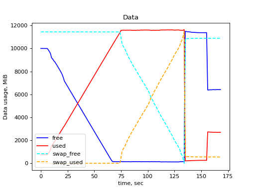
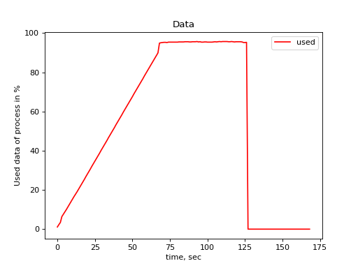
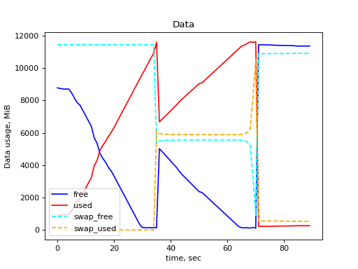
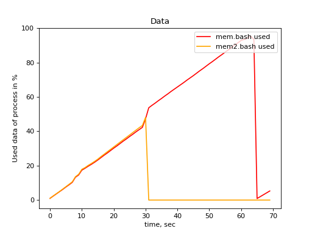
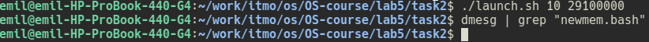
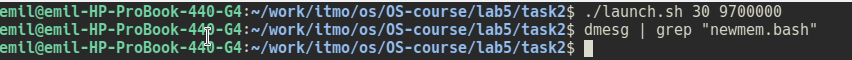

# Отчет по лабораторной работе №5.

## Данные о текущей конфигурации операционной системы в аспекте управления памятью.

| Характеристика                                               | Размер(MiB) |
| :----------------------------------------------------------- | ----------- |
| Общий объем оперативной памяти                               | 11877 MiB   |
| Объем раздела подкачки                                       | 11442 MiB   |
| Размер страницы виртуальной памяти                           | 4 MiB       |
| Объем свободной физической памяти в ненагруженной системе    | 1480 MiB    |
| Объем свободного пространства в разделе подкачки в ненагруженной системе | 11410 MiB   |

## Использование памяти

### Первый эксперимент

#### Первый этап

Последние строки файла  **report.log** :

```
Array size:  291000000
Step:  29100000
```

Последние записи о скрипте **mem.bash** в системном журнале :

```bash
user@user:~/lab5$ dmesg | grep "mem.bash" 

[  781.383484] [   1865]  1000  1865  5689924  2909029 45645824  2778567             0 mem.bash
[  781.383495] oom-kill:constraint=CONSTRAINT_NONE,nodemask=(null),cpuset=/,mems_allowed=0,global_oom,task_memcg=/user.slice/user-1000.slice/session-3.scope,task=mem.bash,pid=1865,uid=1000
    [  781.383507] Out of memory: Killed process 1865 (mem.bash) total-vm:22759696kB, anon-rss:11636116kB, file-rss:0kB, shmem-rss:0kB, UID:1000 pgtables:44576kB oom_score_adj:0
[  781.746852] oom_reaper: reaped process 1865 (mem.bash), now anon-rss:0kB, file-rss:0kB, shmem-rss:0kB
```

Перечень процессов в **top** во время работы скрипта **mem.bash** :

```bash
------------------------------------------INFO------------------------------------------
Step:  9
top - 21:45:00 up 6 min,  7 users,  load average: 0,34, 0,79, 0,49
Tasks: 204 total,   2 running, 202 sleeping,   0 stopped,   0 zombie
%Cpu(s): 24,6 us,  1,5 sy,  0,0 ni, 69,2 id,  0,0 wa,  0,0 hi,  4,6 si,  0,0 st
MiB Mem :  11877,4 total,   9729,3 free,   1004,0 used,   1144,2 buff/cache
MiB Swap:  11443,0 total,  11443,0 free,      0,0 used.  10394,5 avail Mem 

    PID USER      PR  NI    VIRT    RES    SHR S  %CPU  %MEM     TIME+ COMMAND
   1865 emil      20   0  279436 273216   3172 R 100,0   2,2   0:04.07 mem.bash
   1528 emil      20   0  793364 109920  85560 S   6,7   0,9   0:04.07 dolphin
   1715 emil      20   0  708192  92492  72752 S   6,7   0,8   0:01.20 konsole
   1842 emil      20   0   11876   3792   3252 S   6,7   0,0   0:00.05 top
      1 root      20   0  167816  11712   8500 S   0,0   0,1   0:01.18 systemd

-->mem.bash-script line:  1865 emil 20 0 289996 283776 3172 R 100,0 2,3 0:04.23 mem.bash

........................................................................................

------------------------------------------INFO------------------------------------------
Step:  134
top - 21:50:32 up 11 min,  6 users,  load average: 3,00, 1,81, 1,00
Tasks: 192 total,   2 running, 190 sleeping,   0 stopped,   0 zombie
%Cpu(s): 24,6 us,  4,8 sy,  0,0 ni, 12,6 id, 55,6 wa,  0,0 hi,  2,4 si,  0,0 st
MiB Mem :  11877,4 total,    149,2 free,  11586,8 used,    141,4 buff/cache
MiB Swap:  11443,0 total,    386,7 free,  11056,2 used.     40,4 avail Mem 

    PID USER      PR  NI    VIRT    RES    SHR S  %CPU  %MEM     TIME+ COMMAND
   1865 emil      20   0   21,3g  11,0g   1312 R  29,4  95,2   5:32.26 mem.bash
    102 root      20   0       0      0      0 D   7,8   0,0   0:19.43 kswapd0
      1 root      20   0  167816    704    704 S   0,0   0,0   0:01.18 systemd
      2 root      20   0       0      0      0 S   0,0   0,0   0:00.00 kthreadd
      3 root       0 -20       0      0      0 I   0,0   0,0   0:00.00 rcu_gp

-->mem.bash-script line:  1865 emil 20 0 21,3g 11,1g 1312 R 100,0 95,3 5:32.42 mem.bash

```

------


| Величина                                                 | Значение  |
| -------------------------------------------------------- | --------- |
| Размер массива в конце работы скрипта **mem.bash** (`N`) | 291000000 |



> График отображающий кол-во использованной памяти процессом **mem.bash**



> График отображающий процент использованной памяти от общей памяти процессом **mem.bash**

------

Во время работы скрипта **mem.bash** этот скрипт занимал верхнуюю позициюю среди процессов в **top**:

```bash
PID USER      PR  NI    VIRT    RES    SHR S  %CPU  %MEM     TIME+ COMMAND
1865 emil      20   0 8701564   8,3g   3172 R 100,0  71,5   2:07.78 mem.bash
   1 root      20   0  167816  11712   8500 S   0,0   0,1   0:01.18 systemd
   2 root      20   0       0      0      0 S   0,0   0,0   0:00.00 kthreadd
   3 root       0 -20       0      0      0 I   0,0   0,0   0:00.00 rcu_gp
   4 root       0 -20       0      0      0 I   0,0   0,0   0:00.00 rcu_par_gp
```

##### Пороговые величины

- Всего программе было выделено `11636116/1024=11363.3945 KiB` физической памяти. То есть скрипту была выделена почти вся имеющаяся оперативная память. 

- Когда память закончилась все страницы выделенной для процесса памяти были скопированы на раздел подкачки(swap). Позже процесс был прерван и вся память выделенная процессу освобождилась.

#### Второй этап

Последние строки файла  **report.log** :

```
Array size:  289000000
Step:  28900000
```

Последние строки файла  **report2.log** :

```
Array size:  146000000
Step:  14600000
```

Последние записи о скриптах **mem.bash** и **mem2.bash** в системном журнале :

```bash
user@user:~/lab5$ dmesg | grep "mem[2]*.bash" 

[  765.783016] [   3779]  1000  3779  2825392  1455865 22679552  1367335             0 mem.bash
[  765.783017] [   3780]  1000  3780  2854168  1454418 22917120  1397402             0 mem2.bash
[  765.783024] oom-kill:constraint=CONSTRAINT_NONE,nodemask=(null),cpuset=/,mems_allowed=0,global_oom,task_memcg=/user.slice/user-1000.slice/session-3.scope,task=mem2.bash,pid=3780,uid=1000
[  765.783033] Out of memory: Killed process 3780 (mem2.bash) total-vm:11416672kB, anon-rss:5817672kB, file-rss:0kB, shmem-rss:0kB, UID:1000 pgtables:22380kB oom_score_adj:0
[  765.976770] oom_reaper: reaped process 3780 (mem2.bash), now anon-rss:0kB, file-rss:0kB, shmem-rss:0kB
[ 1151.672144] [   3779]  1000  3779  5659861  2871944 45400064  2785604             0 mem.bash
[ 1151.672160] oom-kill:constraint=CONSTRAINT_NONE,nodemask=(null),cpuset=/,mems_allowed=0,global_oom,task_memcg=/user.slice/user-1000.slice/session-3.scope,task=mem.bash,pid=3779,uid=1000
[ 1151.672169] Out of memory: Killed process 3779 (mem.bash) total-vm:22639444kB, anon-rss:11487776kB, file-rss:0kB, shmem-rss:0kB, UID:1000 pgtables:44336kB oom_score_adj:0
[ 1152.098615] oom_reaper: reaped process 3779 (mem.bash), now anon-rss:0kB, file-rss:0kB, shmem-rss:0kB

```

------


| Величина                                                     | Значение  |
| ------------------------------------------------------------ | --------- |
| Размер первого массива в конце работы скрипта **mem.bash** (`N`) | 289000000 |
| Размер второго массива в конце работы скрипта **mem2.bash**  | 146000000 |



> График отображающий кол-во использованной памяти процессами **mem.bash** и **mem2.bash**




> График отображающий процент использованной памяти от общей памяти процессами **mem.bash** и **mem2.bash**


Во время работы скрипта **mem.bash** и **mem2.bash** эти скрипт занимали верхнуюю позициюю среди процессов в **top** до тех пор, пока один из скриптов не был прерван из-за нехватки памяти. Далее, когда один скрипт был прерван, второй продолжал свою работу и для него выделялась память и он так же занимал первую строчку среди процессов.

```bash
PID USER      PR  NI    VIRT    RES    SHR S  %CPU  %MEM     TIME+ COMMAND
   3779 emil      20   0 8534452   5,5g    572 R   0,8  47,3   2:15.76 mem.bash
   3780 emil      20   0 8691004   5,6g    568 R   0,8  48,1   2:14.75 mem2.bash
      1 root      20   0  167680    984    816 D   0,1   0,0   0:01.26 systemd
    690 root      20   0 1073020   1352      0 S   0,1   0,0   0:02.84 snapd
   4214 emil      20   0   11856   2048   1396 R   0,1   0,0   0:00.04 top
```

```bash
PID USER      PR  NI    VIRT    RES    SHR S  %CPU  %MEM     TIME+ COMMAND
   3779 emil      20   0   14,1g   8,9g    952 R  93,8  76,5   3:59.00 mem.bash
      1 root      20   0  167680   5372   3796 S   0,0   0,0   0:01.30 systemd
      2 root      20   0       0      0      0 S   0,0   0,0   0:00.00 kthreadd
      3 root       0 -20       0      0      0 I   0,0   0,0   0:00.00 rcu_gp
      4 root       0 -20       0      0      0 I   0,0   0,0   0:00.00 rcu_par_gp
```

##### Пороговые величины

- Cкрипту **mem.bash** `11487776/1024=11218.5312 KiB` было выделено физической памяти. А скрипту **mem2.bash**  `5817672/1024=5681.32031 KiB`(примерно половина от всей `RAM`) . Что логично, так как когда оба скрипта исполнялись они делили общую имеющуюся память пополам. Когда скрипт **mem2.bash** был прерван другому скрипту выделилась вся оставшаяся память.

- После прерывания скрипта **mem2.bash** когда почти вся память была выделена для **mem.bash** все страницы выделенной для процесса памяти были скопированы на раздел подкачки(`swap`). Позже процесс был прерван и вся память выделенная процессу освободилась.
- Так как второй скрипт за время своей работы имел в два раза меньше выделенной памяти массив второго скрипта получился примерно в два раза меньше чем массив первого. 

### Второй эксперимент

| Величина                                                     | Значение  |
| ------------------------------------------------------------ | --------- |
| Размер массива в конце работы скрипта **mem.bash** из первого эксперимента (`N`) | 291000000 |

- При запуске `K=10` копий скрипта **newmem.bash** с ограничием на размер массива `N'=291000000/10=29100000` все скрипты завершились успешно. Ошибок в системном журнале нет:

  

  Все скрипты завершены успешно потому что в сумме всем скриптам выделилось `N\K*K=N=291000000` памяти. То есть столько же, сколько и в первом этапе первого эксперимента. 

- Попытка увеличить `K` до `30`  закончилась тем, что ряд процессов завершился аварийно. Это происходит потому что скриптов стало много и суммарно они требуют памяти больше чем всего `RAM`.

  [Записи в системном журнале об аварийном завершении скриптов](task2/k30_sisjournal-log.log)

- Макимальное `N'` при котором `K=30` процессов завершатся успешно подобрать можно следующим образом: `N' = N / 30 = 9700000 `. Можно убедиться что все скрипты завершились успешно :

  